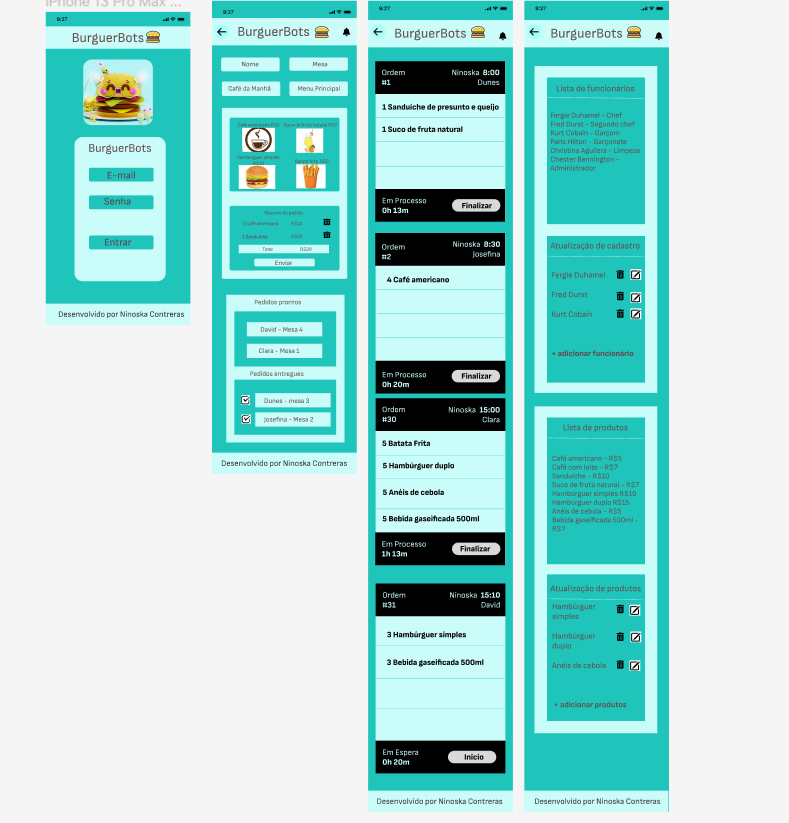
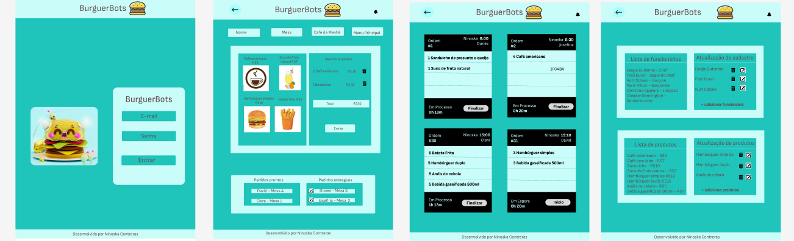
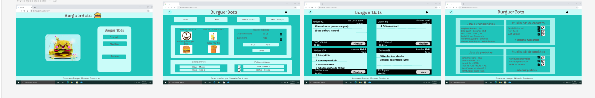

# BurgerBots 🍔 

https://burger-bots.vercel.app/

* [1. Prefácio](#1-prefácio)
* [2. Resumo do projeto](#2-resumo-do-projeto)
* [3. Histórias de usuário](#3-histórias-de-usuario)
* [4. Protótipos](#4-protótipos)
* [5. Tecnologias Utilizadas](#5-tecnologias-utilizadas)
* [6. Desenvolvedora](#6-desenvolvedora)
  

## 1. Prefácio 📋
[Angular](https://angular.io/) é uma _framework_ de JavaScript usada em desenvolvimento em todo o mundo e há uma razão para isso.
No contexto do navegador, [_manter a interface sincronizada com o estado é difícil_](https://medium.com/dailyjs/the-deepest-reason-why-modern-javascript-frameworks-exist-933b86ebc445).
Ao escolher uma _framework_ para nossa interface, contamos com uma série de implementações e convenções _testadas_ e _documentadas_ para resolver um problema comum a toda interface web. Isso nos permite focar melhor (gastar mais tempo) nos recursos _específicos_ de nosso aplicativo.

## 2. Resumo do projeto 📝
BurgerBots é um projeto desenvolvido durante o bootcamp da Laboratoria. É um sistema de gerenciamento de pedidos projetado para um restaurante, que consiste em quatro telas principais:

Tela de Login: Nesta tela, os usuários podem acessar o sistema usando seu e-mail e senha.

Tela do Garçom: Nesta seção, os garçons podem receber e enviar pedidos dos clientes para a cozinha. O menu oferece duas opções: café da manhã e menu principal. Além disso, esta tela inclui duas seções para visualizar os pedidos prontos e os pedidos entregues.

Tela da Cozinha: Aqui, os cozinheiros podem ver os pedidos em ordem, juntamente com o tempo decorrido e o tempo estimado de preparação para cada pedido.

Tela de Administração: Esta tela permite aos administradores gerenciar a lista de funcionários e produtos. Eles também podem adicionar, modificar ou excluir funcionários e produtos conforme necessário.

O BurgerBots oferece uma solução completa para o gerenciamento de pedidos e administração de um restaurante, atendendo às necessidades tanto dos garçons quanto da cozinha, além de fornecer ferramentas eficientes de administração.

## 3. Histórias de usuário 📝

<strong>História de usuário 1:</strong>  Garçom/Garçonete deve poder entrar no sistema, caso o admin já lhe tenha dado as credenciais. Eu, como garçom/garçonete quero entrar no sistema de pedidos.

<strong>História de usuário 2:</strong> Garçom/Garçonete deve ser capaz de anotar o pedido do cliente. Eu como garçom/garçonete quero poder anotar o pedido de um cliente para não depender da minha memória, saber quanto cobrar e poder enviar os pedidos para a cozinha para serem preparados em ordem.

<strong>História de usuário 3:</strong> Chefe de cozinha deve ver os pedidos.
Eu como chefe de cozinha quero ver os pedidos dos clientes em ordem, poder marcar que estão prontos e poder notificar os garçons/garçonetes que o pedido está pronto para ser entregue ao cliente.

<strong>História de usuário 4:</strong> Garçom/Garçonete deve ver os pedidos prontos para servir. Eu como garçom/garçonete quero ver os pedidos que estão prontos para entregá-los rapidamente aos clientes.

<strong>História de usuário 5:</strong> Administrador(a) de loja deve administrar seus funcionários. Eu como administrador(a) de loja quero gerenciar os usuários da plataforma para manter atualizado as informações de meus funcionários.

<strong>História de usuário 6:</strong> Administrador(a) de loja deve administrar os produtos. Eu como administrador(a) de loja quero gerenciar os produtos para manter atualizado o menu.

## 4. Protótipos 📝

#### Protótipo de alta fidelidade Mobile

#### Protótipo de alta fidelidade Tablet

#### Protótipo de alta fidelidade Desktop

## 5. Tecnologias Utilizadas

  

 ## 6. Desenvolvedora

Ninoska Contreras

 
